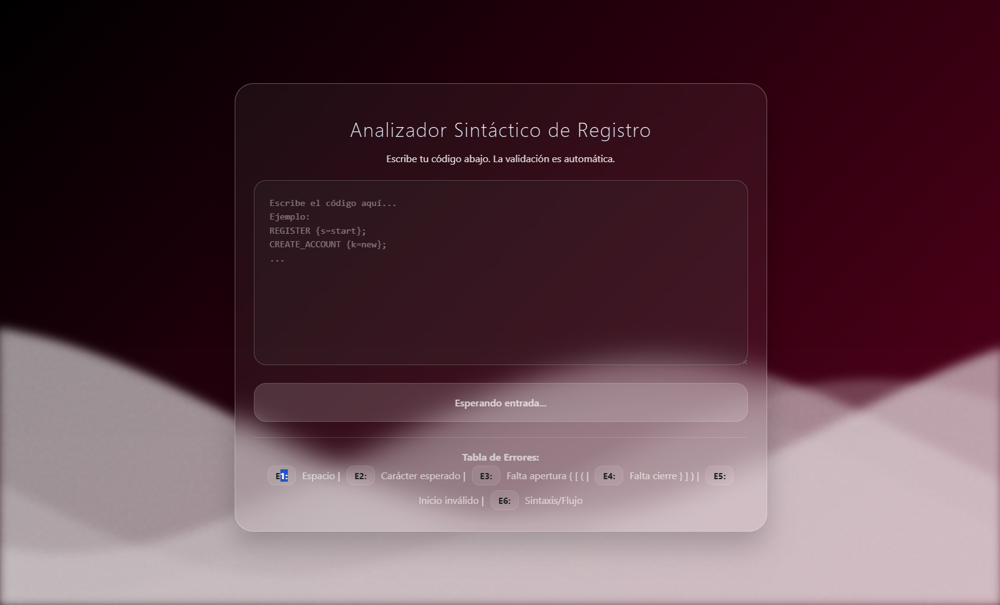

🌊 User Registration Automata Validator


Un validador de sintaxis y flujo para un proceso de registro de usuarios, basado en la teoría de Autómatas y Compiladores. Este proyecto presenta una interfaz moderna estilo **Liquid Glass (Glassmorphism)** con animaciones de fondo, desenfoque gaussiano y texturas de ruido.



✨ Características

🎨 Interfaz (UI/UX)
* **Estilo Liquid Glass:** Inspirado en las interfaces modernas de iOS/Apple.
* **Efectos Visuales:**
    * **Glassmorphism:** Contenedores semitransparentes con `backdrop-filter: blur`.
    * **Fondo Animado:** Olas SVG en movimiento continuo con efecto Parallax.
    * **Textura:** Capa de ruido (grain) y desenfoque para un acabado "frosted glass" realista.
* **Feedback Visual:** La barra de estado cambia de color (Verde, Rojo, Naranja) según el estado del código en tiempo real.

🧠 Lógica (Backend/Script)
* **Análisis Léxico (Lexer):** Tokeniza la entrada separando palabras clave, símbolos y operadores.
* **Análisis Sintáctico (Parser):** Valida la estructura de cada instrucción basada en reglas estrictas.
* **Máquina de Estados (Automata):** Valida el flujo lógico (ej. no puedes ir a `CHECK_EMAIL` sin pasar por `INPUT_EMAIL`).
* **Sistema de Errores:** Detecta y clasifica errores específicos (E1 - E6).

🛠️ Tecnologías Usadas

* **HTML5:** Estructura semántica.
* **CSS3:** Animaciones (`@keyframes`), SVG styling, Filtros (`blur`, `contrast`), Gradientes.
* **JavaScript (ES6+):** Lógica del autómata, manipulación del DOM y manejo de eventos.

## 📋 Guía de Sintaxis

El autómata valida el siguiente flujo de "Happy Path" (Camino Feliz), pero también soporta ciclos de error y caminos alternativos.

**Ejemplo de código válido:**

```text
REGISTER {s=start};
CREATE_ACCOUNT {k=new};
INPUT_EMAIL [email=w];
CHECK_EMAIL (status=VALID);
INPUT_NAME [name=w];
CHECK_NAME (status=VALID);
INPUT_BIRTH_DAY [age=w];
CHECK_AGE (age>18);
INPUT_PASS [pass=w];
INPUT_PASSAGAIN [pass=w];
CHECK_PASS (status=VALID);
SHOW_CAPTCHA [captcha=w];
CHECK_CAPTCHA (status=VALID);
REGISTER_SUCCESS {s=end};
CREATE_ANOTHER_ACCOUNT {k=new};
FINISH {s=finish};
```
